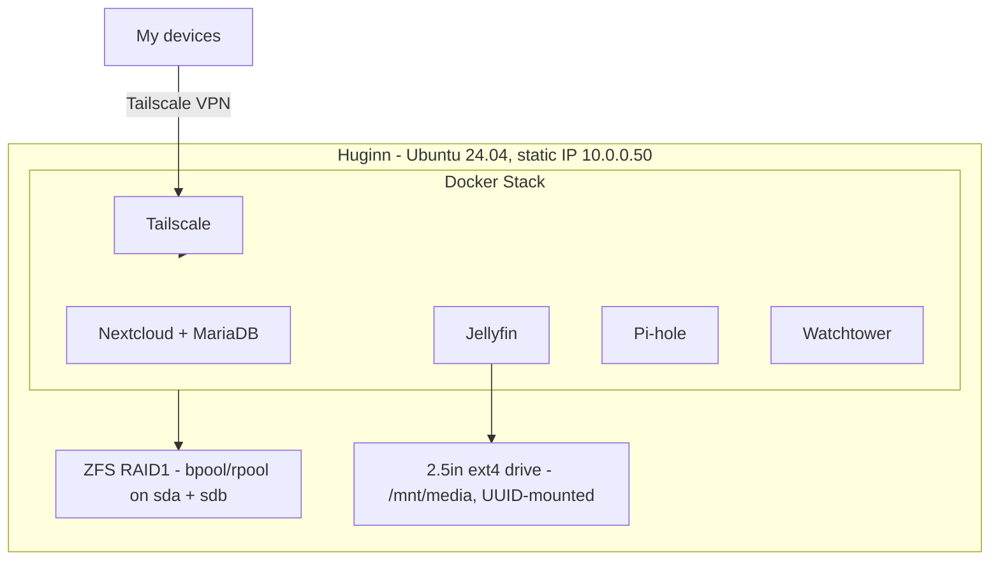

# Huginn — Home Media & Private Cloud Server

Huginn is a self-hosted media and private cloud server I built and maintain on bare-metal Ubuntu 24.04. It runs a Dockerized service stack behind ZFS-mirrored storage, with security and reliability handled the way a small production system would be — not just "run and forget."

**Last updated:** 2026-08-19

## Overview

The goal was a self-hosted alternative to commercial cloud storage and media streaming, run entirely on hardware I control, with the same fundamentals (redundancy, access control, monitoring, patching) that a real production box needs.

## Architecture

## Services

| Service | Purpose |
|---|---|
| Nextcloud + MariaDB | Private cloud storage; admin account + separate member account for my partner |
| Jellyfin | Media streaming, backed by a dedicated ext4 drive at `/mnt/media` |
| Pi-hole | Network-wide DNS ad-blocking and local DNS resolution (10.0.0.50) |
| Watchtower | Automatic container updates |
| Tailscale | Zero-config VPN mesh for remote access (100.124.116.118) — no ports exposed to the public internet |
| Sunshine + Moonlight | Remote game streaming from the server to other devices on the network/VPN |

## Key architecture decisions

- **ZFS RAID1 (bpool/rpool on sda/sdb)** — chosen over a single-disk setup for redundancy and ZFS's built-in integrity checking (scrubbing), not just raw capacity.
- **Tailscale over port-forwarding** — remote access to Nextcloud/Jellyfin goes over a private mesh VPN instead of exposing services directly to the internet, cutting the attack surface significantly compared to the typical homelab port-forward setup.
- **Static IP + UUID-mounted storage** — avoids the config drift and silent failures that come from DHCP leases or `/dev/sdX`-style mount references changing across reboots.

## Security posture

Security isn't bolted on after the fact here — it's part of the base setup:

- **SSH key-only authentication** — password auth disabled entirely
- **Fail2Ban** — automated banning on repeated failed login attempts
- **UFW** — default-deny firewall, only required ports open
- **ClamAV** — on-access/scheduled malware scanning
- **Monthly ZFS scrub (cron)** — catches silent data corruption before it becomes data loss
- **Tailscale-only remote access** — no public-facing management ports

## Notable troubleshooting

See [`docs/`](./docs) for full writeups:
- [DVD ripping pipeline](./docs/dvd-ripping-pipeline.md) — MakeMKV + HandBrake, H.265 MKV output, Jellyfin naming conventions
- [Trickplay permissions fix](./docs/trickplay-permissions-fix.md) — resolving a root-owned file issue in Jellyfin's trickplay generation
- [Nextcloud trusted domain fix](./docs/nextcloud-trusted-domain.md) — resolving a trusted domain misconfiguration
- [Pi-hole local DNS setup](./docs/pihole-local-dns.md) — configuring Pi-hole for local DNS resolution alongside ad-blocking

## Ongoing work

The media library is actively growing — DVDs and CDs are being ripped and added on a rolling basis using the pipeline documented above.

## Roadmap

Planned improvements are tracked as [GitHub Issues](../../issues) — includes moving the Docker stack to version-controlled `docker-compose.yml`, an Ansible playbook for provisioning, and a monitoring stack.

## Changelog

See [`CHANGELOG.md`](./CHANGELOG.md) for the running history of changes to this system.

---

*This is a personal infrastructure project — architecture, security hardening, and ongoing maintenance are all my own work.*
